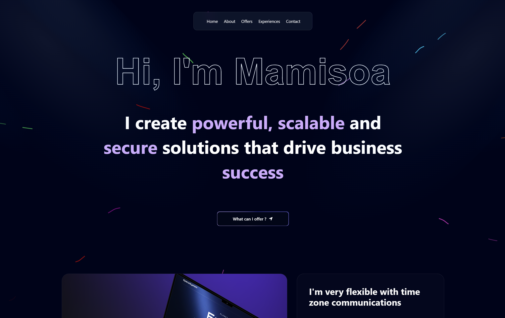

# Mamisoa Hyacinthe – Portfolio

This is a professional portfolio website developed for **Mamisoa Hyacinthe**, built using **Next.js** with advanced animation and smooth transitions to showcase his profile, experience, and skills.

You can view the live site here: [portfolio-mamisoa.vercel.app](https://portfolio-mamisoa.vercel.app)

---

## ✨ Features

- Smooth animations and transitions
- Responsive design for all screen sizes
- Sections for about, experience, projects, and contact
- Built with performance and accessibility in mind

---

## 🛠️ Tech Stack

- [Next.js](https://nextjs.org/)
- [React](https://react.dev/)
- [Framer Motion](https://www.framer.com/motion/) for animation
- [Tailwind CSS](https://tailwindcss.com/)
- Deployed on [Vercel](https://vercel.com/)

---

## 📸 Screenshot

> Make sure to add a screenshot named `screenshot.png` inside the `public` directory of your project.

---

## 📬 Contact

If you'd like a custom portfolio or want to collaborate, feel free to reach out.
